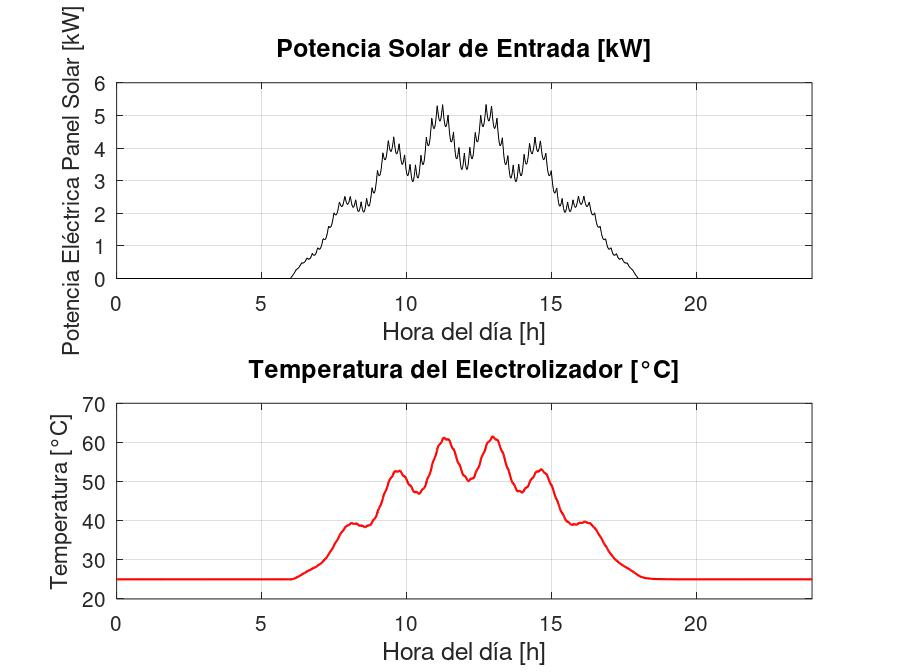

# Modelo y Simulación de un Electrolizador PEM

Este repositorio contiene un conjunto de scripts de Octave/MATLAB diseñados para modelar, validar y simular el comportamiento electroquímico y térmico de un electrolizador PEM.

El proyecto se divide en dos partes principales:
1.  **Validación del Modelo:** Se recrea y compara una curva de polarización (Voltaje vs. Corriente), curva Hidrógeno producido vs potencia eléctrica (H2 vs kW) y una curva de trabajo específico con datos del siguiente paper de referencia. Link: https://www-sciencedirect-com.pucdechile.idm.oclc.org/science/article/pii/S1876610217363506
2.  **Simulación Dinámica:** Se utiliza el modelo validado para simular el comportamiento térmico del electrolizador (aumento de temperatura) cuando es alimentado por una fuente de potencia variable, como un panel solar en un día nublado. link paper de referencia: https://research-ebsco-com.pucdechile.idm.oclc.org/c/r6zury/viewer/pdf/atk445bn25?route=details

---

## Parte 1: Validación de Curva de Polarización (main_PROYECTO.m)

Este script se enfoca en la validación del modelo electroquímico en estado estacionario. Utilizar `main_PROYECTO.m`

### Objetivo
El objetivo es recrear la curva de polarización (Voltaje vs. Densidad de Corriente) presentada en el paper (identificado en los gráficos como "Modelo Colbertaldo P.") y comparar los resultados del modelo recreado bajo las mismas condiciones de operación (55°C y 70 bar). 

### Funcionamiento
1.  **Define Condiciones:** Establece los parámetros de operación (temperatura `T_op_C` y presión `P_op_bar`). La temperatura y presión se puede cambiar. 
2.  **Cálculo del Modelo:** Llama a la función `calcularCurvaPolarizacion.m` con un vector de densidades de corriente (`i_input_vector`) el cual debe ser escrito como lista dentro del código. 
3.  **Cálculo de Sobrepotenciales:** Dentro de `calcularCurvaPolarizacion.m`, el voltaje total de la celda se calcula como la suma de los potenciales y sobrepotenciales:
 
    
      $V_{cell} = V_{id} + V_{act} + V_{ohm} + V_{diff}$
   
    * **$V_{id}$ (Potencial Ideal/Nernst):** Se calcula utilizando la variación de energía libre de Gibbs $\Delta G(T)$ dentro del archivo `calculo_DeltaG.m` y las presiones parciales (obtenidas con la librería `XSteam.m`).
      
      $V_{id} = \frac{\Delta G(T)}{nF} + \frac{RT}{nF} \ln \left( \frac{p_{H_2} \cdot p_{O_2}^{0.5}}{a_{H_2O}} \right)$
      
    * **$V_{act}$ (Sobrepotencial de Activación):** Modelado con la simplificación de Tafel para el ánodo y el cátodo.
      
      $V_{act} = \frac{RT}{\alpha_{an} nF} \ln \left( \frac{i}{i_{0,an}} \right) + \frac{RT}{\alpha_{cat} nF} \ln \left( \frac{i}{i_{0,cat}} \right)$

      En esta oportunidad, se realiza la estimación de las densidad de corriente de intercambio para tener un mejor ajuste en comparación a la curva del paper.

    * **$V_{ohm}$ (Sobrepotencial Óhmico):** Considera la resistividad de electrodos y la conductividad de la membrana (calculada con la correlación de Springer).
      
      $R_{anodo} = \tau_{anodo} \cdot \rho_{anodo}$
      
      $R_{catodo} = \tau_{catodo}\cdot \rho_{catodo}$
  
      $R_{elec} = R_{anodo} + R_{catodo}$
  
      Se toma el supuesto de una resistencia de contacto $R_{contact} = 0.175$ ohms.
  
      $\sigma_{mem} = (0.005139 \lambda - 0.00326) \cdot \exp \left[ 1268 \left( \frac{1}{303.15} - \frac{1}{T} \right) \right]$

      $V_{ohm} = i \cdot \left( R_{elec} + \frac{t_{mem}}{\sigma_{mem}} + R_{contact} \right)$
      
    * **$V_{diff}$ (Sobrepotencial por Difusión):** Modelado en base a la corriente límite (`i_L`).

      $V_{diff} = \frac{RT}{\alpha_{an} nF} \ln \left( \frac{i_L}{i_L - i} \right)$

5.  **Comparación:** El script calcula el error entre el vector de voltajes calculado (`V_cell`) con el vector de voltajes del paper (`Vcell_paper`), este útlimo debe ser escrito como lista dentro del código. 
6.  **Generación de Gráficos:** Se generan tres figuras que comparan el "Modelo recreado" vs. el "Modelo Colbertaldo P.":
    * Curva de Polarización (V vs. A/cm²).
    * Producción de H₂ (Nm³/h) vs. Potencia Eléctrica (kW).
    * Trabajo Específico (kWh/kg H₂) vs. Producción de H₂ (g/h).

---

## Parte 2: Simulación Dinámica con Perfil Solar (main_SIMULACION.m)

Este script utiliza el modelo electroquímico validado para simular el comportamiento dinámico de la PEM, enfocándose en la respuesta térmica a una fuente de energía intermitente de un panel solar en un día nublado. Utilizar `main_SIMULACION.m`

### Objetivo
Simular la evolución de la **temperatura** y la **corriente** de la PEM durante 24 horas, asumiendo que es alimentado por un panel solar en un día nublado.

### Funcionamiento
1.  **Define Parámetros del Sistema:** Establece parámetros globales para la simulación dinámica, como la capacidad térmica total de la PEM (`C_tot`), el coeficiente de transferencia de calor con el ambiente (`UA`), y la temperatura ambiente (`T_amb_K`). El sistema trabaja a presión constante.
2.  **Perfil de Potencia Solar:** Define una función anónima `P_target_func(t)` que entrega la potencia eléctrica (en Watts) disponible del panel solar en cualquier segundo `t` del día. Esta función simula un día nublado con variaciones rápidas.

Para estimar la potencia generada por un panel solar en un día nublado, se utiliza la ecuación de densidad de corriente que se menciona en el paper:

   $$
   I_{cloudy}(t) = S_{max} sin\left(\frac{\pi(\frac{t}{3600} - t_{\text{rise}})}{t_{\text{set}} - t_{\text{rise}}}\right)\left[1- a_1 \left|\sin\left(b_1\pi\frac{\frac{t}{3600} - t_{\text{rise}}}{t_{\text{set}} - t_{\text{rise}}}\right)\right|^{c_1}-a_2\left|\sin\left(b_2\pi\frac{\frac{t}{3600} - t_{\text{rise}}}{t_{\text{set}} - t_{\text{rise}}}\right)\right|^{c_2}\right]
   $$
   
La potencia en el tiempo se calcula como:
   
   $$
   P(t) = I_{\text{cloudy}}(t) \cdot A \cdot \eta
   $$
   
Donde:  
* A = El area de los paneles solares
* $\eta$ = Eficiencia de los paneles solares
* $S_{\max}$ = irradiancia máxima del día  

Se define la potencia máxima como:

   $$
   P_{max} = A \cdot \eta \cdot S_{max}
   $$

   Reemplazando:

   $$
   P(t) = P_{max} sin\left(\frac{\pi(\frac{t}{3600} - t_{\text{rise}})}{t_{\text{set}} - t_{\text{rise}}}\right)\left[1- a_1 \left|\sin\left(b_1\pi\frac{\frac{t}{3600} - t_{\text{rise}}}{t_{\text{set}} - t_{\text{rise}}}\right)\right|^{c_1}-a_2\left|\sin\left(b_2\pi\frac{\frac{t}{3600} - t_{\text{rise}}}{t_{\text{set}} - t_{\text{rise}}}\right)\right|^{c_2}\right]
   $$
   
3.  **Modelo Matemático (Sistema DAE):** En el código (`sistema_dae.m`), no definimos las derivadas explícitamente, sino que calculamos las residuales del sistema.

   $$
   M \cdot \dot{y} = f(t,y)
   $$

   
Donde:
* $y = [T_{K}, I_{cell}]$ es el vector de estado (Temperatura y Corriente).
* $M$ es la **Matriz**, que define qué ecuaciones son diferenciales y cuáles son algebraicas.
* $\text{res}$ es el vector de residuos calculado en cada paso de tiempo.


    * **Definición de los Residuos:** El script `sistema_dae.m` calcula dos residuos que representan los balances de energía y de igualdad:

Residuo Diferencial (`res1`): Balance de Energía.

       
$$
C_{\text{tot}} \frac{dT}{dt} = \underbrace{P(t) - \left(\dot{N}_{H_2} \cdot \Delta H(T)\right)}_{\text{Calor generado neto}} - \underbrace{UA \left(T - T_{\text{amb}}\right)}_{\text{Pérdidas térmicas}}
$$
          

   Este residuo representa la acumulación de energía térmica. El código calcula la diferencia entre el calor generado y el disipado:
        
$$
\text{res}_1 = \underbrace{(P(t) - \dot{N}_{H_2} \cdot \Delta H(T))}_{\text{Calor Generado Neto}} - \underbrace{UA \cdot (T - T_{amb})}_{\text{Calor Disipado}}
$$

Al multiplicar por la masa térmica en la matriz $M$ ($M_{1,1} = C_{tot}$), la ecuación diferencial resultante es: 

$$
C_{tot} \cdot \frac{dT}{dt} = \text{res}_1
$$

Donde:

- $P_{\text{t}}$: potencia eléctrica entregada del panel solar a la PEM
- $\dot{N}_{H_2}$: flujo molar de hidrógeno producido, el cual es calculado con la ecuación de Faraday.
  
$$
\dot{N}_{H_2} = \frac{I_{cell}(t) \cdot N_{cell} \cdot A}{\eta F}
$$


- $\Delta H(T)$: La entalpía de reacción no es constante, sino que varía con la temperatura. En el script `calculo_DeltaG_MODIFICADO.m`, esta se calcula ajustando el valor estándar a 298.15 K mediante la integral de las capacidades caloríficas ($C_p$):

$$
\Delta H(T) = \Delta H^{\circ}_{298K} + \int_{298.15}^{T} \Delta C_p(T) dT
$$

Donde el término $\Delta C_p(T)$ representa la diferencia de capacidades caloríficas entre productos y reactivos para la reacción de electrólisis:

$$
H_2O \to H_2 + 0.5 O_2
$$

$$
\Delta C_p(T) = \left( C_{p,H_2}(T) + 0.5 \cdot C_{p,O_2}(T) \right) - C_{p,H_2O(l)}(T)
$$

Los valores de $C_p$ se modelan utilizando polinomios de la base de datos **NIST**.

- $UA$: coeficiente global de pérdidas térmicas 
- $T$: temperatura de la PEM en Kelvin
- $T_{\text{amb}}$: temperatura ambiente en Kelvin  


Residuo Algebraico (`res2`): Balance de Potencia.

Este residuo fuerza a que sea cero la resta entre la potencia entregada del panel solar y la potencia de la PEM. Calcula la discrepancia entre la energía disponible y la consumida:

$$
\text{res}_2 = P_{in}(t) - \underbrace{V_{cell}(I_{cell}, T) \cdot I_{cell} \cdot A \cdot N_{cells}}_{\text{Potencia Consumida de la PEM}}
$$

Para realizar el cálculo de voltaje, el solver llama continuamente a `calcular_voltaje_ESCALAR.m`. Esta es una versión optimizada del modelo de la Parte 1, diseñada para calcular el voltaje para un solo valor (escalar) de corriente y temperatura.

Dado que el término correspondiente en la matriz de masa es cero ($M_{2,2} = 0$), el solver ajusta la corriente instantáneamente para que:

$$
0 = \text{res}_2
$$

En definitiva, el solver resuelve el sistema lineal en cada paso de tiempo siguiendo la estructura matricial $M \cdot \dot{y} = \text{res}$:

$$
\begin{bmatrix}
C_{\text{tot}} & 0 \\
0 & 0
\end{bmatrix} 
\cdot 
\begin{bmatrix}
\dfrac{dT}{dt} \\
\dfrac{dI_{\text{cell}}}{dt}
\end{bmatrix}
=\begin{bmatrix}
\text{res}_1 \\
\text{res}_2
\end{bmatrix}
$$


4.  **Solver:** El solver `ode15s` itera en cada paso de tiempo para encontrar la temperatura (`T_K_act`) y la corriente (`i_cell_act`) que satisfacen ambas ecuaciones simultáneamente.


5.  **Resultados:** El script genera un gráfico de 24 horas que muestra:
    * Arriba: El perfil de potencia de entrada del panel solar (kW).
    * Abajo: La evolución de la temperatura del electrolizador (°C) como respuesta a esa potencia.



---

## Estructura de Archivos y Dependencias

### Scripts Principales
* `main_PROYECTO.m`: Ejecuta la validación del modelo estacionario.
* `main_SIMULACION.m`: Ejecuta la simulación dinámica de 24 horas.

### Funciones del Modelo
* `calcularCurvaPolarizacion.m`: (Vectorizado) Calcula la curva V-I completa para la validación a una cierta temperatura y presión.
* `calcular_voltaje_ESCALAR.m`: (Escalar) Calcula un solo punto (V, I) para el solver DAE. Maneja el caso `i=0` para evitar errores matemáticos.
* `sistema_dae.m`: Define el sistema DAE (balance de energía y potencia) para `ode15s`.
* `calculo_DeltaG.m` y `calculo_DeltaG_MODIFICADO.m`: Calculan propiedades termodinámicas (ΔG, ΔH, ΔS) en función de la temperatura, usando integrales de polinomios de Cp.

### Bibliotecas Externas
* `XSteam.m`: **Dependencia externa necesaria.** Es la biblioteca para calcular propiedades termodinámicas del agua y vapor (ej. `psat_T` para la presión de saturación).

## Cómo Usar
1.  Asegúrese de tener Octave o MATLAB instalado.
2.  Coloque todos los archivos `.m` en el mismo directorio.
3.  IMPORTANTE: Asegúrese de que la biblioteca `XSteam.m` esté en el path de Octave/MATLAB.
4.  Para la validación del modelo estacionario:
    ```octave
    >> main_PROYECTO
    ```
5.  Para la simulación dinámica del sistema:
    ```octave
    >> main_SIMULACION
    ```
